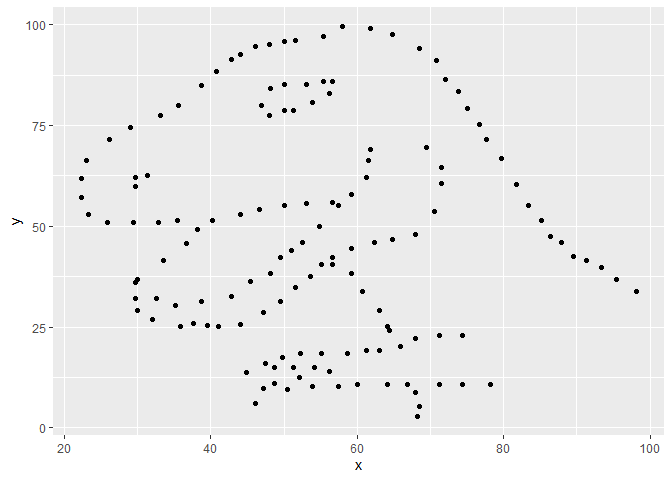

Lab 01 - Hello R
================
Rachel Good
12/26/2021

## Load packages and data

``` r
library(tidyverse) 
library(datasauRus)
```

## Exercises

### Exercise 1

The datasaurus dozen file has 1846 rows and 3 variables/columns.

### Exercise 2

First let’s plot the data in the dino dataset:

``` r
dino_data <- datasaurus_dozen %>%
  filter(dataset == "dino")

ggplot(data = dino_data, mapping = aes(x = x, y = y)) +
  geom_point()
```

<!-- -->

And next calculate the correlation between `x` and `y` in this dataset:

``` r
dino_data %>%
  summarize(r = cor(x, y))
```

    ## # A tibble: 1 x 1
    ##         r
    ##     <dbl>
    ## 1 -0.0645

### Exercise 3

``` r
#Would add plot data here
```

There is a chunk above for adding plot code, and a chunk below for
adding correlation code.

``` r
# Would add correlation code here
```

### Exercise 4

Here I practice naming the chunks and adding the code. Note to self: The
names do not have to say star - star can be anything

``` r
dino_data <- datasaurus_dozen %>%
  filter(dataset == "dino")

ggplot(data = dino_data, mapping = aes(x = x, y = y)) +
  geom_point()
```

<!-- -->

``` r
dino_data %>%
  summarize(r = cor(x, y))
```

    ## # A tibble: 1 x 1
    ##         r
    ##     <dbl>
    ## 1 -0.0645

### Exercise 5

To add R chunks either type out the backticks, curly braces, and the
letter `r` or use the Insert chunk button above, green C+.

## Bonus Tips by Yoo Ri

Here are some helpful tips :)

-   filter() is for extracting rows

-   group\_by() is for grouping datasets by assigned column

-   ungroup() cancels the grouping

-   summarize() is often used with group\_by(). This function can print
    the output according to the group\_by().

-   facet\_grid(y\~x,…) creates a grid with variable y as a row,
    variable x as a column  

-   facet\_wrap(x,… ) is useful when there is only one variable
